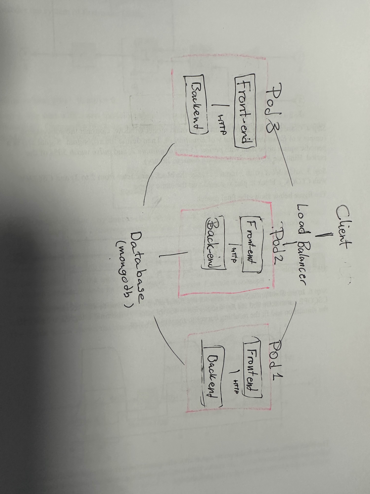

Select one issue to address

The issue is that if our backend crashes, our whole website is unusable, because we only have one instance of it. This would become noticeable if the website crashes ( because there is no other instance running), if we have a lot of traffic running or if we wanna update or do changes on the website. Meaning, if we create more instances, we would solve these three issues. 

Propose a solution and discuss trade-offs 
We added a load balance, and three different computers
By having three different servers that run the backend, we make sure that if one fails, there is a backup so that the user will be redirected and won't notice any changes in their user-experience. Furthermore, we improve our ability to update without disturbing the user, since at least one server will be up and running. And, with the help of the load balancer, we can distribute the traffic so that no server can be overloaded. 

tradeoffs 
Slight overhead when using a load balancer 
More hardware (more instances)
More effort to manage 

Plan the refactoring required to implement the selected solution 

We need to get a docker file. Since we use nextJS we don't really need to change a lot in the codebase.

Begin refactoring 
We added a docker File in our project 

Add basic logging 

We already had a logging when an error occurred. 

